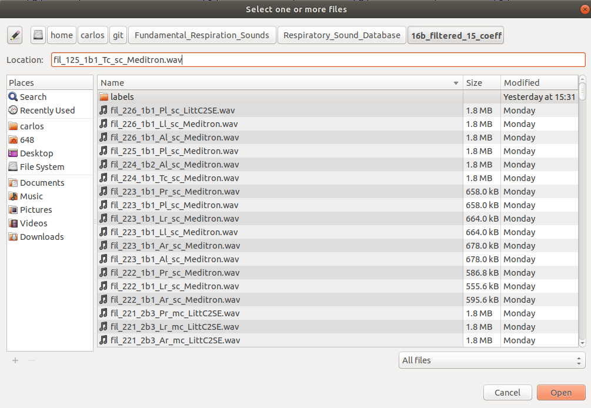
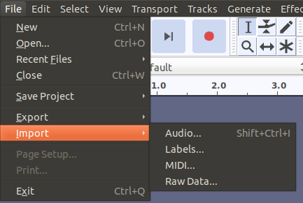
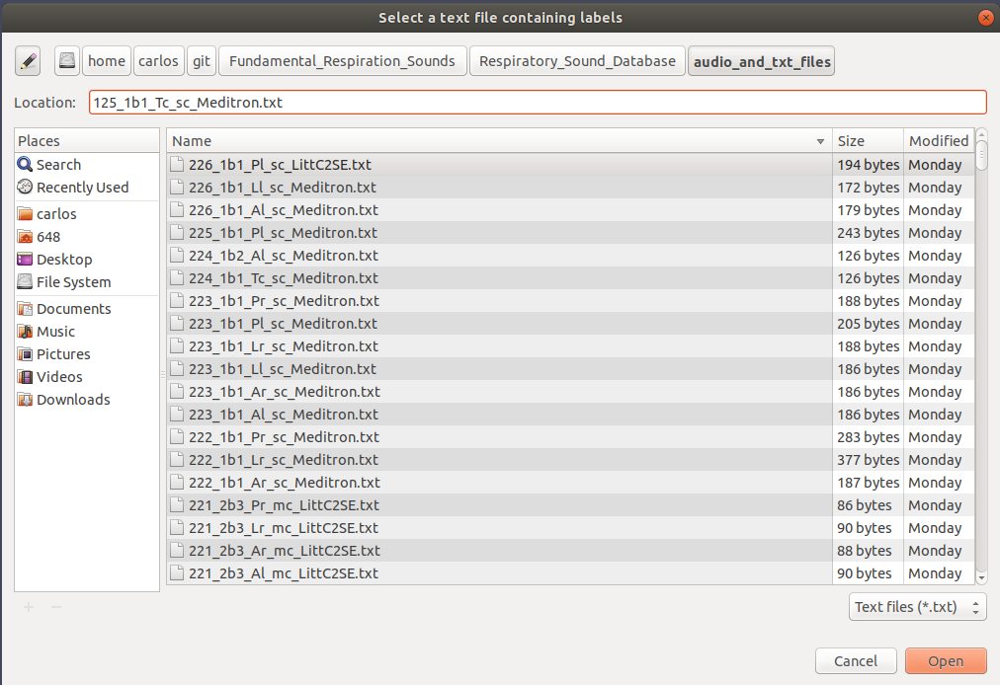
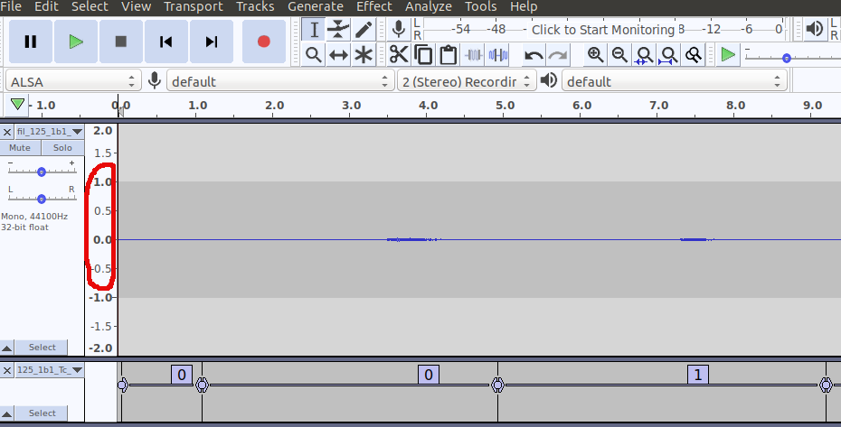
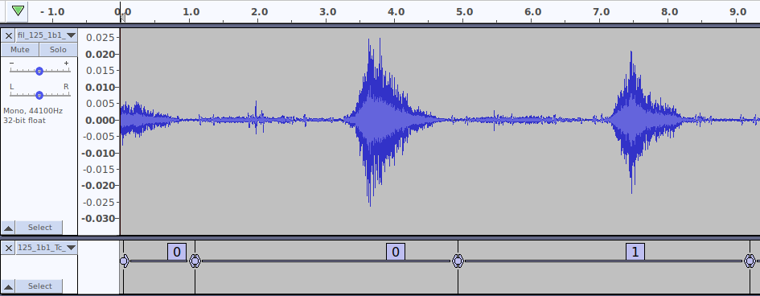
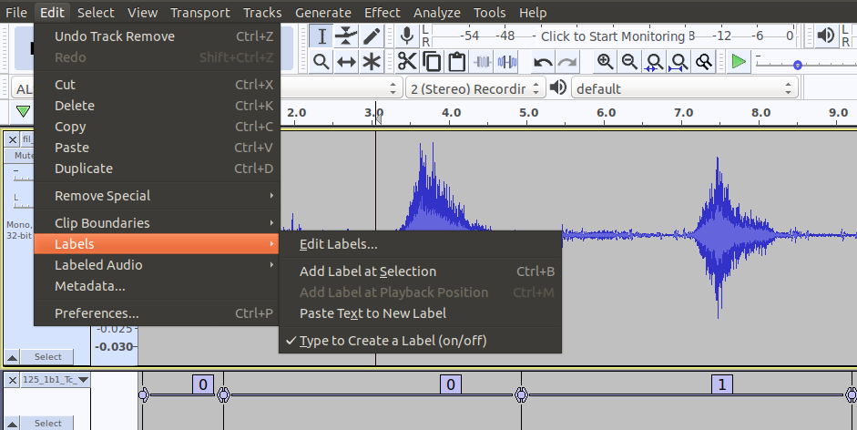
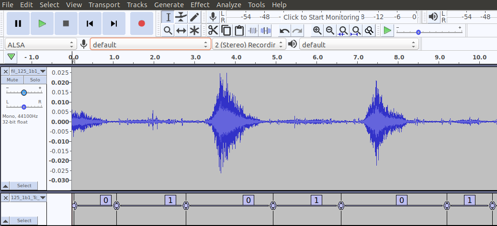

# Labelling tutorial
In this tutorial, we will learn how to use [Audacity](https://www.audacityteam.org/) to load audio files and modify existing label files.

**Author:**
- **Carlos Salgado** - GitHub: [@socd06](https://github.com/socd06)

## Installation

### Ubuntu
Install using `Ubuntu Software` app

### Windows
Download from [Audacity's Downloads page](https://www.audacityteam.org/download/) or build from source

## Loading labels and audio files
### Loading audio
To load the audio files, go to `File` --> `Open`

You can use the processed audio files from the `Respiratory_Sound_Database/16b_filtered_15_coeff` folder for labelling since they easier to listen to.

Go to the folder and click `Open`

### Loading labels

To load the annotation text files (*.txt) open Audacity and go to `File` --> `Import` --> `Labels`

Browse to the `audio_and_txt_files` folder and select the label text (*.txt) file that corresponds to the loaded audio file and click `Open`

## Adjusting waveplot

You should see something like this after loading both the audio and the labels file:

Move your cursor to the part marked in red. You will see your cursor become a magnifying glass.

Click several times the until the waveplot appears more readable to you. As such:

Now we can inspect the waveplot and listen to the audio track to add a few more labels instead of relabelling the whole track.
To take into account the original work, we should try to add data points, instead of replacing the originals.

## Labelling

Find a peak corresponding to one of the respiratory phases, mark the region of interest and click `Edit` --> `Labels` --> `Add Label at Selection` or push `Ctrl+B`

Mark the *inspiratory* phase as `0` and the *expiratory* phase as `1` and repeat the process until finished. You should see something similar to the following:

## Exporting labels

To save the new label files go to `File` --> `Export` --> `Export Labels`
And save in a different folder to prevent overwriting the original files.

### Exporting labelled tracks
You can export the segmented  tracks going to `File` --> `Export` --> `Export Multiple`
and select `Split files based on` --> `Labels`

Go to [Audacity's Home Page](https://www.audacityteam.org/)
